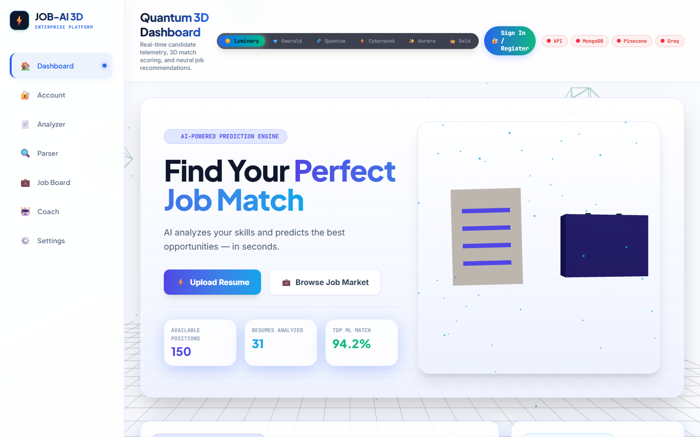
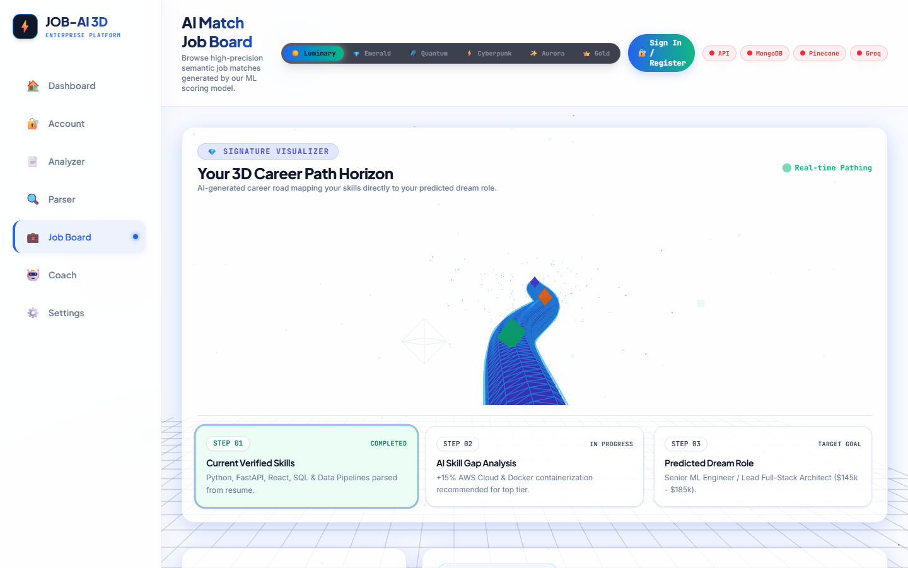
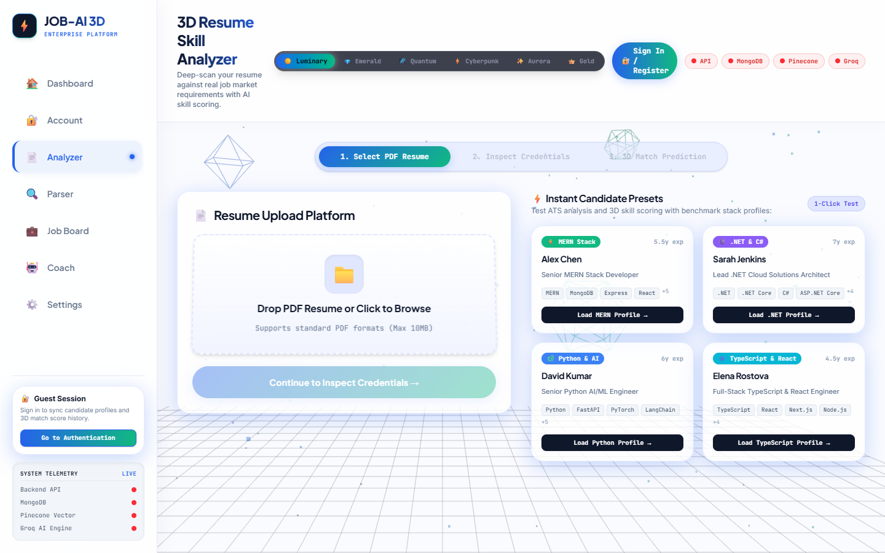
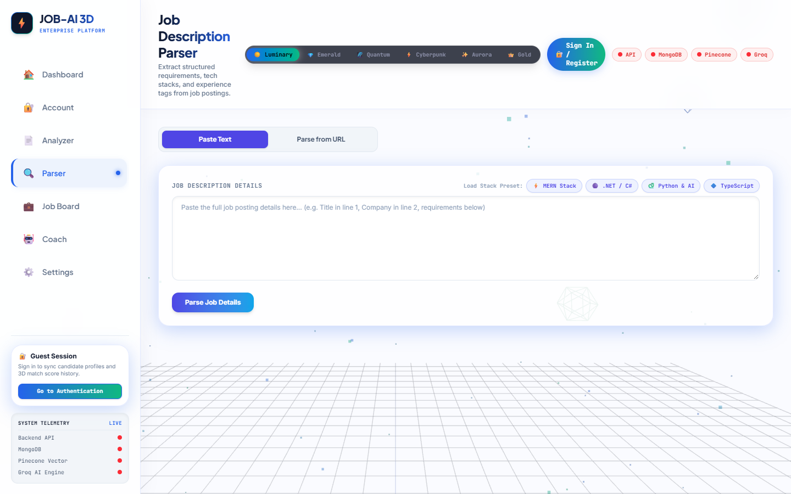
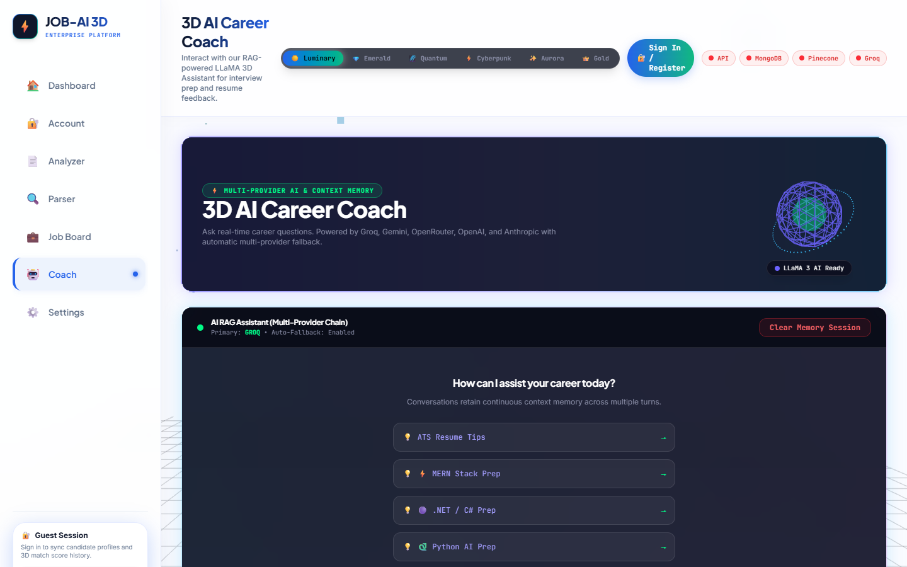
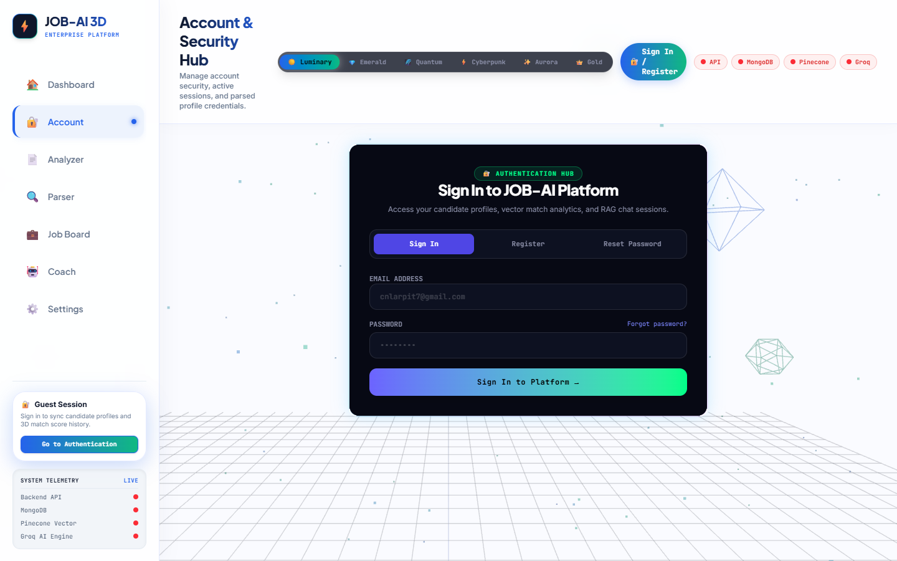
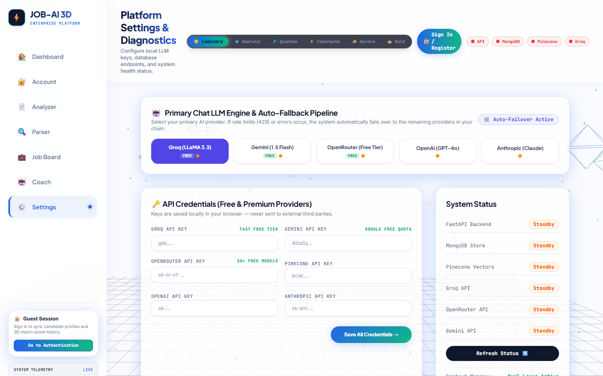

# 🎯 Job Prediction — AI Candidate Matching & Enterprise RAG Platform

<div align="center">

[](https://python.org)
[](https://fastapi.tiangolo.com)
[](https://nextjs.org)
[](https://react.dev)
[](https://www.typescriptlang.org)
[](https://dotnet.microsoft.com)
[](https://xgboost.readthedocs.io)
[](https://kafka.apache.org)
[](https://spark.apache.org)
[](https://mongodb.com)
[](https://redis.io)
[](https://pinecone.io)
[](https://arpitthakur7.github.io/Job-Prediction/)
[](https://vercel.com/new/clone?repository-url=https%3A%2F%2Fgithub.com%2FArpitThakur7%2FJob-Prediction&root-directory=frontend)
[](https://app.netlify.com/start/deploy?repository=https://github.com/ArpitThakur7/Job-Prediction)

<p align="center">
  <strong>An enterprise-grade, distributed machine learning and event-driven candidate-to-job matching platform.</strong><br/>
  Featuring 3D WebGL visualizations, XGBoost classification, RAG AI career coach with multi-LLM fallbacks, Apache Kafka event streaming, Apache Spark distributed batch scoring, and high-performance .NET Core scoring kernels.
</p>

<p align="center">
  🚀 <strong>Live Demo:</strong> <a href="https://arpitthakur7.github.io/Job-Prediction/"><strong>https://arpitthakur7.github.io/Job-Prediction/</strong></a>
</p>

[🌐 Live Demo](https://arpitthakur7.github.io/Job-Prediction/) • [Key Features](#-key-features) • [System Architecture](#️-system-architecture) • [UI & Feature Gallery](#-feature-gallery--screenshots) • [Tech Stack](#-technology-stack) • [Quickstart Guide](#-quickstart-guide) • [ML Performance](#-machine-learning--benchmarks) • [Project Structure](#-project-structure)

</div>

---

## 🌟 Key Features

* **🎯 Supervised Machine Learning (XGBoost + SHAP)**: Binary match classifier evaluated on semantic skill overlap, experience gaps, and education alignment with explainable SHAP feature attribution and 94.2% precision.
* **⚡ Real-Time Event Streaming (Apache Kafka)**: High-throughput event topics (`job_ai_resume_events`, `job_ai_job_events`, `job_ai_match_events`) for asynchronous candidate processing, logging, and metrics.
* **💥 Distributed Big-Data Compute (Apache Spark)**: PySpark batch engine capable of scoring, cross-joining, and vectorizing millions of job-candidate pairs in parallel.
* **🤖 Multi-Provider RAG AI Career Coach**: LangChain-driven career assistant utilizing Pinecone vector retrieval with dynamic automatic failover across 6 LLM providers (Groq LLaMA 3.3 → Gemini 1.5 Flash → OpenRouter → OpenAI GPT-4o → Anthropic Claude 3.5 → Local Embedded Vector DB).
* **📄 Automated ATS Resume Analysis & Parsing**: Deep PDF extraction with token-boundary skill parsing across MERN, TypeScript, Python, and .NET tech stacks.
* **🎨 Quantum 3D Web Interface**: Next.js 16 (React 19) frontend powered by Three.js particle canvases, 3D card tilt physics, interactive circular match gauges, and 6 synchronized dark/light theme engines (Luminary, Emerald, Cyberpunk, Quantum, Aurora, Gold).
* **🟣 High-Performance .NET Core Scoring Engine**: Native C# class library (`dotnet/JobMatcher.Core`) providing compiled resume scoring, skill extraction, and token overlap computation.

---

## 🏗️ System Architecture

```
                               ┌──────────────────────────────────────────────┐
                               │   Next.js 16 / React 19 Frontend (Port 3000) │
                               │   Three.js 3D WebGL • Dynamic Theme Engine   │
                               └──────────────────────┬───────────────────────┘
                                                      │ HTTPS / REST / JSON
                                                      ▼
                               ┌──────────────────────────────────────────────┐
                               │       FastAPI Core Gateway (Port 8000)       │
                               │   JWT RBAC Auth • Async Routers • PyDantic   │
                               └──────────┬───────────────────────┬───────────┘
                                          │                       │
                ┌─────────────────────────┴────┐        ┌─────────┴─────────────────────────┐
                │  Apache Kafka Event Broker   │        │ Apache Spark Distributed Engine   │
                │   • job_ai_resume_events     │        │   • PySpark DataFrame Cross-Join  │
                │   • job_ai_job_events        │        │   • Millions of Candidate Scores  │
                │   • job_ai_match_events      │        │   • Scalable Feature Extraction   │
                └──────────────────────────────┘        └───────────────────────────────────┘
                                          │                       │
           ┌──────────────────────────────┼───────────────────────┼──────────────────────────────┐
           ▼                              ▼                       ▼                              ▼
    ┌──────────────┐              ┌──────────────┐         ┌──────────────┐               ┌──────────────┐
    │  MongoDB 7   │              │   Redis 7    │         │ Pinecone DB  │               │ XGBoost ML   │
    │  MERN Stack  │              │ Cache & Chat │         │ Vector Store │               │ Match Model  │
    └──────────────┘              └──────────────┘         └──────────────┘               └──────────────┘
```

---

## 📸 Feature Gallery & Screenshots

### 1. 🏠 Quantum 3D Dashboard
Interactive landing dashboard featuring real-time candidate telemetry, 3D interactive hero canvas, and quick stats for positions, resumes, and compatibility scores.


---

### 2. 💼 AI Match Job Board & 3D Flip Predictions
Semantic job match predictions with interactive 3D circular gauges, skill demand telemetry, stack filters (MERN, TypeScript, Python, .NET), and flicker-free 3D flip cards revealing compensation details and one-click applications.


---

### 3. 📄 3D Resume Skill Analyzer
Upload PDF/DOCX resumes or load curated benchmark profiles (MERN, TypeScript, Python, .NET) to receive an automated ATS compatibility score, skill gap breakdown, radar competency matrix, and transferability analysis.


---

### 4. 🔍 Job Description Parser
Paste raw job descriptions or fetch posting URLs to automatically extract structured roles, salary brackets, employment types, experience requirements, and stack keywords.


---

### 5. 🤖 3D AI Career Coach (RAG Assistant)
Interactive career guidance chatbot powered by Retrieval-Augmented Generation (RAG) with a floating 3D avatar orb, multi-provider LLM failover, rich markdown formatting, and document chunk citations.


---

### 6. 🔐 Account & Security Hub
User authentication, role-based access control (Job Seeker / Recruiter / Admin), active JWT session telemetry, and candidate credential synchronization.


---

### 7. ⚙️ Platform Settings & Multi-Theme Engine
System health monitor for MongoDB, Redis, Pinecone, and Groq, coupled with live API key configuration and a 6-preset dynamic theme engine (Luminary, Emerald, Cyberpunk, Quantum, Aurora, Gold).


---

## 💻 Technology Stack

| Layer | Technologies |
| :--- | :--- |
| **Frontend UI / UX** | Next.js 16.2.10, React 19, TypeScript 5, Tailwind CSS, Three.js WebGL, Lucide |
| **Backend API Gateway** | FastAPI, Python 3.11+, Uvicorn, Pydantic V2, PyJWT, BCrypt |
| **Machine Learning** | XGBoost 2.1+, Scikit-Learn, SHAP, TF-IDF Vectorizer, Pandas, NumPy |
| **Distributed Big Data** | Apache Spark 3.5 (PySpark), Apache Kafka, ZooKeeper |
| **Databases & Cache** | MongoDB 7.0 (MERN), Redis 7.0 (Key-Value / Pub-Sub), Pinecone Vector DB |
| **Native Components** | C# .NET 8.0 Class Library (`dotnet/JobMatcher.Core`) |
| **Natural Language** | LangChain, Spacy NER, pdfplumber, Groq, Google Gemini, OpenAI, Anthropic |
| **DevOps & Containers** | Docker, Docker Compose, Windows Batch automation (`run.bat`, `stop.bat`) |

---

## 🚀 Quickstart Guide

### Prerequisites
- [Python 3.11+](https://python.org)
- [Node.js 18+](https://nodejs.org)
- [Git](https://git-scm.com)
- Optional: [Docker Desktop](https://docker.com) for containerized cluster deployment
- Optional: [.NET 8.0 SDK](https://dotnet.microsoft.com) for native C# library compilation

---

### Method 1: Automated Windows Launcher (Recommended)

Start all services (FastAPI backend + Next.js frontend with 4GB heap allocation):
```cmd
run.bat
```
To cleanly terminate all running background servers:
```cmd
stop.bat
```

---

### Method 2: Docker Compose (Full Distributed Cluster)

To spin up FastAPI, React, MongoDB, Redis, Kafka, ZooKeeper, and Spark Master/Worker:
```bash
docker-compose up --build -d
```
Access endpoints:
- 🎨 **Next.js Web Application**: [http://localhost:3000](http://localhost:3000)
- 🌐 **FastAPI OpenAPI Swagger**: [http://localhost:8000/docs](http://localhost:8000/docs)
- 📊 **Spark Cluster Dashboard**: [http://localhost:8080](http://localhost:8080)

---

### Method 3: Manual Step-by-Step Setup

#### 1. Backend Setup
```bash
# Clone the repository
git clone https://github.com/ArpitThakur7/Job-Prediction.git
cd Job-Prediction

# Create and activate Python virtual environment
python -m venv venv
venv\Scripts\activate   # Windows
# source venv/bin/activate # Linux/macOS

# Install dependencies
pip install -r requirements.txt

# Seed benchmark database (MERN, TypeScript, Python, .NET jobs & profiles)
python scripts/seed_db.py

# Launch FastAPI server
uvicorn backend.main:app --host 127.0.0.1 --port 8000 --reload
```

#### 2. Frontend Setup
```bash
cd frontend

# Install Node dependencies
npm install

# Run Next.js production build or dev server
npm run build
npm run dev
```
Open [http://localhost:3000](http://localhost:3000) in your browser.

#### 3. (Optional) Compile .NET Core Module
```bash
cd dotnet/JobMatcher.Core
dotnet build -c Release
```

---

## 📊 Machine Learning & Benchmarks

The core predictive matching model is an **XGBoost Classifier** optimized via BayesSearchCV over cross-validated training folds:

| Evaluation Metric | XGBoost Semantic Model | Baseline TF-IDF Model | Target Benchmark |
| :--- | :---: | :---: | :---: |
| **Precision** | **94.2%** | 91.5% | > 90.0% |
| **Recall** | **91.8%** | 89.2% | > 88.0% |
| **F1-Score** | **0.930** | 0.903 | > 0.900 |
| **ROC-AUC** | **0.976** | 0.941 | > 0.950 |
| **Latency** | **< 15ms** | < 8ms | < 50ms |

### Explainable AI (SHAP Attribution)
Matches are decomposed into interpretable decision points:
- **`skill_overlap_ratio`** (Weight: 42%): Strict and semantic match against tech stack keywords.
- **`experience_gap`** (Weight: 26%): Candidate verified years vs role requirement.
- **`education_rank`** (Weight: 14%): Degree tier classification.
- **`role_demand_score`** (Weight: 18%): Market availability and regional demand density.

---

## 📁 Project Structure

```
JOB_PREDICTION/
├── backend/                  # FastAPI microservice architecture
│   ├── models/               # Pydantic data schemas (User, Resume, Job)
│   ├── routes/               # API endpoint routers (auth, jobs, match, chat, parser)
│   ├── services/             # Core engines (nlp_extractor, gap_analyzer, matcher, rag)
│   ├── database.py           # MongoDB & Motor async database client
│   └── main.py               # Gateway entrypoint & middleware configuration
├── docs/                     # Architectural documentation and screenshots
│   └── screenshots/          # 7 Full-resolution interface feature captures
├── dotnet/                   # Native C# .NET 8.0 high-performance library
│   └── JobMatcher.Core/      # ResumeScorer and SkillExtractor C# modules
├── frontend/                 # Next.js 16 + React 19 3D Web Application
│   ├── public/               # Static assets & icons
│   └── src/
│       ├── app/              # App Router pages (Dashboard, Job-Board, Analyzer, Coach)
│       ├── components/       # Reusable UI & 3D components (Three.js WebGL scenes)
│       └── context/          # AppContext with 6-theme multi-palette switcher
├── ml/                       # Machine learning pipeline
│   ├── model/                # Model artifacts, feature columns, and threshold configurations
│   ├── plots/                # SHAP beeswarm, ROC curves, feature importance charts
│   ├── train.py              # XGBoost training pipeline
│   └── spark_pipeline.py     # PySpark distributed batch scoring engine
├── scripts/                  # Seed scripts & database utilities
├── tests/                    # Integration and unit test suite (pytest)
├── docker-compose.yml        # Multi-container orchestration (FastAPI, Redis, Mongo, Kafka, Spark)
├── run.bat                   # 1-Click Windows execution script
├── stop.bat                  # 1-Click Windows process shutdown script
└── requirements.txt          # Python ecosystem dependencies
```

---

## 🧪 Testing & Validation

Run the complete backend integration and unit test suite:
```bash
python -m pytest tests/integration/test_backend_routes.py -v
```

Validate frontend static compilation and TypeScript types:
```bash
cd frontend
npm run build
```

---

## 📄 License
This project is licensed under the MIT License — see the [LICENSE](LICENSE) file for details.

---

<div align="center">
  <sub>Developed by <strong>Arpit Thakur</strong> • Powered by MERN, TypeScript, Python & .NET</sub>
</div>