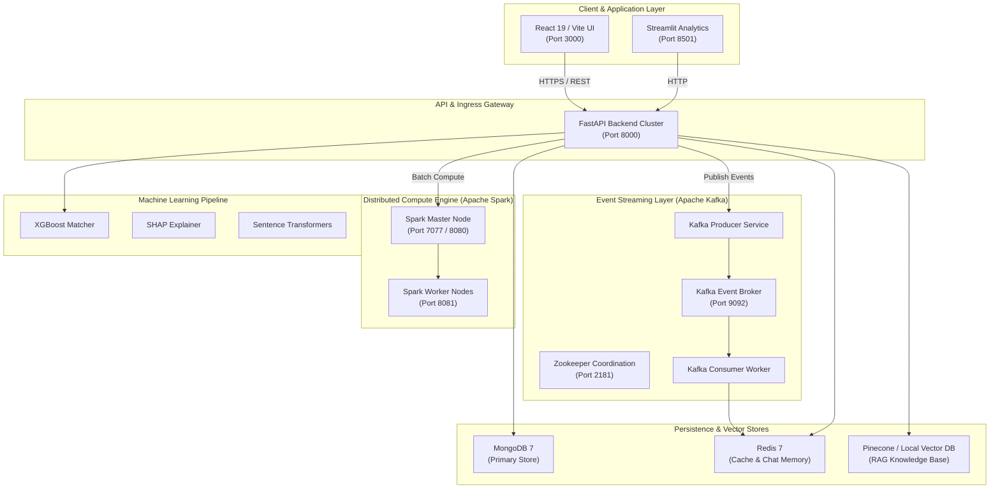

# Enterprise Scalable Cloud Architecture Specification

## Overview

The **JOB-AI-PLATFORM** is an enterprise-grade, event-driven microservices architecture built for high-throughput candidate matching, real-time RAG career coaching, and distributed big-data analytics.



---

## Component Architecture

### 1. API & Ingress Gateway (`backend/`)
- **Framework**: FastAPI with Pydantic Settings
- **Role**: Entry point for authentication, job CRUD, resume uploads, and live queries.
- **Port**: `8000`

### 2. Real-Time Event Streaming (`Apache Kafka`)
- **Topics**:
  - `job_ai_resume_events`: Streamed upon PDF upload & NLP parsing.
  - `job_ai_job_events`: Streamed when recruiters post target job requirements.
  - `job_ai_match_events`: High-speed event logs for candidate-job compatibility.
- **Producer / Consumer**: [`backend/services/kafka_producer.py`](file:///c:/Users/admin/Desktop/JOB_PREDICTION/backend/services/kafka_producer.py) & [`backend/services/kafka_consumer.py`](file:///c:/Users/admin/Desktop/JOB_PREDICTION/backend/services/kafka_consumer.py).

### 3. Distributed Big-Data Processing (`Apache Spark`)
- **Engine**: PySpark 3.5.0 cluster (`ml/spark_pipeline.py`).
- **Role**: Bulk cross-matching over millions of job-resume pairs, distributed TF-IDF vectorization, and data pipeline ETL.

### 4. Vector DB & RAG Pipeline
- **Vector DB**: Pinecone Cloud with local in-memory cosine similarity fallback.
- **LLM Engine**: Multi-provider fallback chain (Groq → Gemini → OpenRouter → OpenAI → Anthropic → Local RAG Engine).

### 5. Datastores
- **MongoDB 7**: Document store for candidate profiles, resumes, and job listings.
- **Redis 7**: Session cache, conversation history, and rate limiting.

---

## Production Cloud Deployment Topology (AWS / GCP)

For enterprise Kubernetes (EKS / GKE) production deployment:

```
[ CloudFlare CDN / AWS Route53 ]
               │
               ▼
   [ AWS ALB / NGINX Ingress Controller ]
               │
     ┌─────────┴─────────┐
     ▼                   ▼
 [ FastAPI Pods ]    [ React UI Static Pods ]
     │                   │
     ├───────────────────┼──────────────────┐
     ▼                   ▼                  ▼
[ Managed Kafka ]  [ Apache Spark ]  [ Amazon DocumentDB / MongoDB ]
  (AWS MSK)       (EMR / Databricks)
```

1. **Ingress**: AWS ALB / NGINX Ingress with SSL termination.
2. **Compute**: Autoscaling Kubernetes Pods (EKS) for FastAPI backend (HPA target 70% CPU).
3. **Kafka Bus**: AWS MSK (Managed Streaming for Apache Kafka) or Confluent Cloud.
4. **Spark Cluster**: AWS EMR or Databricks cluster for multi-node PySpark batch scoring.
5. **Caching & DB**: AWS ElastiCache for Redis + MongoDB Atlas Cluster.